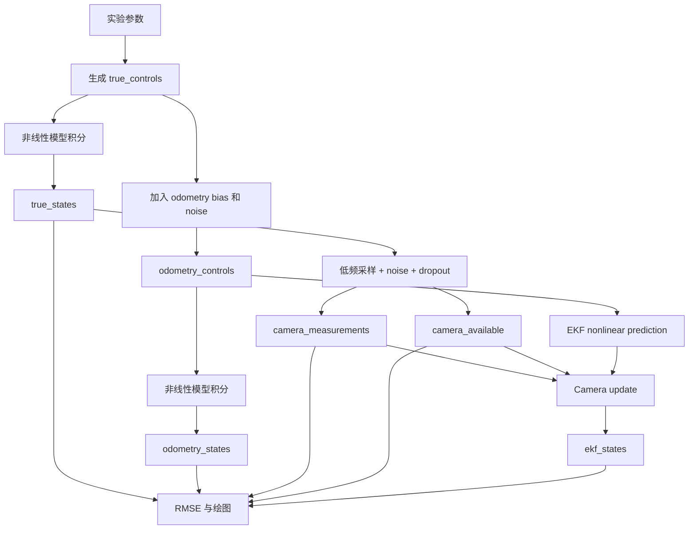

# Day 5：EKF Unicycle Robot Localization

本文件遵循工作区根目录的 [每日学习文件编写规范](../../../每日学习文件编写规范.md)。

## 1. 今日目标

将 Day 4 的线性多传感器融合扩展到带朝向的非线性移动机器人模型：

```text
state = [px, py, theta]
control = [v, omega]
camera measurement = [px, py]
```

使用 odometry control 进行非线性预测，使用低频、带噪声和 dropout 的 camera position 进行 EKF 更新。

最终交付物：

```text
notebooks/04_ekf_unicycle_model.ipynb
figures/ekf_unicycle_trajectory.png
figures/ekf_unicycle_position_error.png
figures/ekf_unicycle_heading_error.png
results/ekf_unicycle_rmse.csv
```

Notebook 跑通后再整理：

```text
scripts/04_ekf_unicycle_model.py
```

## 2. 今日明确不做

- 不加入 IMU bias 状态。
- 不加入 landmark range-bearing measurement。
- 不做 EKF-SLAM。
- 不做 ROS 或真实机器人数据。
- 不做 UKF 或 Particle Filter。
- 不追求完整理论证明，只要求理解模型、Jacobian 和 predict/update 分工。

## 3. 前置条件

开始前应完成：

```text
notes/day03_2d_kf.md
notes/day04_linear_multisensor_fusion.md
notebooks/03_linear_multisensor_fusion.ipynb
```

必须能回答：

1. Odometry 为什么会累计漂移？
2. Camera 为什么放在 `update()`？
3. Camera dropout 时为什么可以跳过 `update()`？
4. Day 4 为什么仍然是线性 KF？

## 4. 参考代码位置

### 4.1 复用自己的代码

```text
scripts/03_linear_multisensor_fusion.py
```

复用：

- camera sampling 和 dropout 逻辑。
- RMSE 计算。
- 输出目录处理。
- 轨迹图和误差图结构。

不要直接复用：

- `[px, py, vx, vy]` 状态。
- 线性匀速 `F`。
- 覆盖 `kf.x[2:4]` 的 odometry 处理方式。

### 4.2 FilterPy EKF 源码

```text
source/filterpy/filterpy/kalman/EKF.py
```

只查看：

- `class ExtendedKalmanFilter`
- `update(z, HJacobian, Hx, ...)`
- `HJacobian` 和 `Hx` 如何被调用
- `P`、`Q`、`R` 的维度

### 4.3 FilterPy 测试

```text
source/filterpy/filterpy/kalman/tests/test_ekf.py
```

只关注：

- 如何创建 `ExtendedKalmanFilter(dim_x, dim_z)`。
- 如何传入 `HJacobian`。
- 如何传入 `Hx`。

不需要阅读整个测试文件。

## 5. 为什么需要 EKF

Day 4 的模型是线性的：

```text
px_new = px + vx * dt
py_new = py + vy * dt
```

Day 5 使用 unicycle model：

```text
px_new = px + v * cos(theta) * dt
py_new = py + v * sin(theta) * dt
theta_new = theta + omega * dt
```

因为存在：

```text
cos(theta)
sin(theta)
```

状态更新不再能写成一个固定矩阵 `x_new = F @ x`，所以需要：

1. 使用非线性函数 `f(x, u)` 预测状态。
2. 使用 Jacobian `F_jacobian` 近似传播协方差。
3. 使用 EKF measurement update 修正状态。

## 6. 状态、控制和观测定义

### 6.1 状态向量

```text
x = [px, py, theta]
```

顺序必须在 MD、Notebook、后续 Python 和结果分析中保持一致。

### 6.2 控制输入

```text
u = [v, omega]
```

- `v`：机器人沿当前朝向前进的线速度。
- `omega`：机器人绕自身旋转的角速度。

### 6.3 Camera 观测

```text
z = [camera_px, camera_py]
```

Camera 不直接测量 `theta`。

## 7. 非线性运动模型

函数建议：

```python
def unicycle_motion_model(state, control, dt):
    ...
```

输入：

```text
state: shape=(3,)，[px, py, theta]
control: shape=(2,)，[v, omega]
dt: 标量
```

输出：

```text
predicted_state: shape=(3,)
```

模型：

```text
px' = px + v*cos(theta)*dt
py' = py + v*sin(theta)*dt
theta' = theta + omega*dt
```

`theta` 更新后必须归一化到：

```text
[-pi, pi)
```

角度归一化函数：

```python
def normalize_angle(angle):
    return (angle + np.pi) % (2 * np.pi) - np.pi
```

## 8. 运动模型 Jacobian

函数建议：

```python
def motion_jacobian(state, control, dt):
    ...
```

对状态 `[px, py, theta]` 求偏导：

```text
F = [[1, 0, -v*sin(theta)*dt],
     [0, 1,  v*cos(theta)*dt],
     [0, 0,  1]]
```

必须能解释：

- `px'` 对 `theta` 的偏导为什么是 `-v*sin(theta)*dt`。
- `py'` 对 `theta` 的偏导为什么是 `v*cos(theta)*dt`。
- Jacobian 不是固定运动矩阵，而是依赖当前 `theta` 和 `v`。

## 9. Camera 观测模型

Camera 只测位置：

```python
def camera_measurement_function(state):
    return state[:2]
```

观测 Jacobian：

```python
def camera_measurement_jacobian(state):
    return np.array([
        [1.0, 0.0, 0.0],
        [0.0, 1.0, 0.0],
    ])
```

形状：

```text
Hx(state): (2,)
HJacobian(state): (2, 3)
```

## 10. Ground Truth 和控制序列

建议参数：

```python
dt = 0.1
num_steps = 200
initial_state = np.array([0.0, 0.0, 0.0])
true_linear_velocity = 1.0
true_angular_velocity = 0.12
```

Ground truth 函数：

```python
def generate_unicycle_ground_truth(...):
    ...
```

每一步使用真实控制：

```text
true_control = [true_linear_velocity, true_angular_velocity]
```

预期轨迹：

```text
机器人沿弯曲轨迹运动，而不是 Day 3/4 的直线。
```

## 11. 模拟 Odometry Control

Odometry 现在提供：

```text
measured_v
measured_omega
```

建议参数：

```python
linear_velocity_bias = 0.03
angular_velocity_bias = 0.008
linear_velocity_noise_std = 0.04
angular_velocity_noise_std = 0.01
```

函数：

```python
def simulate_odometry_controls(true_controls, ...):
    ...
```

输出：

```text
odometry_controls: shape=(num_steps, 2)
```

Odometry-only 轨迹通过同一个非线性 motion model 积分得到。

## 12. 模拟 Camera Measurement

复用 Day 4 的低频观测和 dropout 思路：

```python
camera_noise_std = 0.8
camera_interval = 10
dropout_probability = 0.20
```

输出：

```text
camera_measurements: shape=(num_steps, 2)
camera_available: shape=(num_steps,)
```

无测量时使用 `NaN + mask`，不要传入 `[0, 0]`。

## 13. EKF 非线性预测

FilterPy 的 `ExtendedKalmanFilter.predict()` 默认仍使用线性形式，因此今天建议手动完成非线性预测：

```python
state_before = ekf.x.copy()
F = motion_jacobian(state_before, control, dt)
ekf.x = unicycle_motion_model(state_before, control, dt)
ekf.P = F @ ekf.P @ F.T + ekf.Q
```

顺序不能反：

```text
Jacobian 应根据预测前的 state 和当前 control 计算。
```

## 14. EKF Camera 更新

Camera 可用时：

```python
ekf.update(
    z=camera_measurements[i],
    HJacobian=camera_measurement_jacobian,
    Hx=camera_measurement_function,
)
```

Camera dropout 时：

```text
跳过 update，只保留非线性 prediction。
```

每次预测或更新后都对 `ekf.x[2]` 做角度归一化。

## 15. 建议函数结构

```python
def normalize_angle(angle):
    ...

def unicycle_motion_model(state, control, dt):
    ...

def motion_jacobian(state, control, dt):
    ...

def camera_measurement_function(state):
    ...

def camera_measurement_jacobian(state):
    ...

def generate_unicycle_ground_truth(...):
    ...

def simulate_odometry_controls(...):
    ...

def integrate_odometry_only(...):
    ...

def simulate_camera_measurements(...):
    ...

def create_ekf(...):
    ...

def run_ekf_localization(...):
    ...

def compute_position_rmse(...):
    ...

def compute_heading_rmse(...):
    ...

def plot_trajectory(...):
    ...

def plot_position_error(...):
    ...

def plot_heading_error(...):
    ...
```

## 16. 推荐实现顺序

### Step 1：验证角度归一化

测试：

```text
normalize_angle(3*pi) 应接近 -pi
所有输出应在 [-pi, pi)
```

### Step 2：验证 motion model

检查：

- `theta=0` 时，机器人主要沿 x 方向前进。
- `omega>0` 时，轨迹向左弯曲。
- 状态 shape 为 `(3,)`。

### Step 3：验证 Jacobian

检查：

```text
F shape = (3, 3)
F[2, 2] = 1
F 中与 theta 有关的两项随 theta 改变
```

### Step 4：生成 Ground Truth

先只画 ground truth，确认是平滑曲线。

### Step 5：加入 Odometry Control

画：

```text
ground truth vs odometry only
```

确认 odometry 会随时间偏离。

### Step 6：加入 Camera Measurement

检查：

- Camera 只在采样时刻出现。
- 部分采样时刻发生 dropout。
- 无测量位置为 `NaN`。

### Step 7：实现 EKF Prediction

先不加 camera update，确认 EKF prediction 与 odometry-only 趋势一致。

### Step 8：加入 Camera Update

确认：

- Camera 可用时调用 `update()`。
- Dropout 时跳过 `update()`。
- Camera 恢复后位置误差被修正。

### Step 9：计算误差和 RMSE

计算：

```text
Odometry-only position RMSE
EKF position RMSE
Odometry-only heading RMSE
EKF heading RMSE
Camera position RMSE（仅有效时刻）
```

### Step 10：绘图和保存

保存全部图和 CSV，再执行 `Restart Kernel and Run All`。

## 17. 输出图和结果表

### 17.1 轨迹图

```text
figures/ekf_unicycle_trajectory.png
```

包含：

- Ground truth
- Odometry only
- Camera measurements
- EKF estimate

### 17.2 位置误差图

```text
figures/ekf_unicycle_position_error.png
```

包含：

- Odometry position error
- EKF position error
- Camera position error scatter

### 17.3 朝向误差图

```text
figures/ekf_unicycle_heading_error.png
```

误差必须先归一化：

```text
heading_error = normalize_angle(estimated_theta - true_theta)
```

### 17.4 RMSE 表

```text
results/ekf_unicycle_rmse.csv
```

建议格式：

```csv
method,position_rmse,heading_rmse,evaluation_steps
odometry_only,...,...,200
camera_measurement,...,NaN,...
ekf,...,...,200
```

## 18. 常见错误

### 18.1 状态顺序混乱

本日统一：

```text
[px, py, theta]
```

### 18.2 把角度误差直接相减

`179°` 和 `-179°` 实际只差 `2°`，必须 normalize。

### 18.3 直接用固定线性 F 预测状态

状态必须通过 `unicycle_motion_model()` 更新，Jacobian 只用于传播 `P`。

### 18.4 Jacobian 使用了更新后的 theta

保持明确顺序：先保存 `state_before`，再计算 Jacobian 和预测状态。

### 18.5 Camera dropout 时传入 `[0, 0]`

正确做法是跳过 `update()`。

### 18.6 Notebook 旧输出

代码修改后执行 `Restart Kernel and Run All`，再读取 CSV。

### 18.7 输出文件被占用

关闭 Excel 和图片查看器后重新运行。

## 19. Day 5 验收标准

文件验收：

- Notebook 从头运行成功。
- 三张目标图存在。
- RMSE CSV 存在。

结果验收：

- Ground truth 是弯曲轨迹。
- Odometry-only 存在位置和朝向漂移。
- Camera measurement 稀疏且有 dropout。
- EKF 轨迹连续。
- Camera 恢复时 EKF 位置误差得到修正。
- EKF position RMSE 小于 odometry-only position RMSE。

理解验收：

- 能解释为什么需要 EKF。
- 能写出 unicycle motion model。
- 能解释 motion Jacobian。
- 能解释状态预测和协方差预测的区别。
- 能解释 camera 不测 theta 时为什么仍可能间接改善轨迹。

## 20. 学习结果总结（完成后填写）

### 20.1 完成情况

```text
完成日期：
实际投入时间：
Notebook 是否 Restart Kernel and Run All：
三张图是否生成：
RMSE CSV 是否生成：
遇到的问题：
解决方法：
```

### 20.2 实际参数

```text
dt：
num_steps：
true v：
true omega：
odometry v bias/noise：
odometry omega bias/noise：
camera noise/interval/dropout：
Q：
R：
P：
random_seed：
```

### 20.3 RMSE

```text
Odometry position RMSE：
EKF position RMSE：
Position RMSE 降低百分比：

Odometry heading RMSE：
EKF heading RMSE：
Heading RMSE 降低百分比：

Camera position RMSE：
Camera evaluation steps：
```

### 20.4 必答问题

1. 为什么 unicycle model 是非线性的？

```text
在这里填写。
```

2. Jacobian 在 EKF 中做什么？

```text
在这里填写。
```

3. 为什么状态通过 nonlinear function 预测，而协方差使用 Jacobian 传播？

```text
在这里填写。
```

4. Camera 不测 theta，EKF 如何处理 heading uncertainty？

```text
在这里填写。
```

5. 当前 EKF 实验相对 Day 4 增加了什么？

```text
在这里填写。
```

### 20.5 今日结论

```text
用 4-6 句话总结模型、传感器、EKF、RMSE 和局限。
```

### 20.6 面试表达

中文 45 秒版本：

```text
在这里填写。
```

英文 45 秒版本：

```text
在这里填写。
```

## 21. Notebook 完成后的 Python 文件

Notebook 验收通过后，再按规范整理：

```text
scripts/04_ekf_unicycle_model.py
```

在 notebook 未完整运行前，不把框架直接包装成“已完成 Python 项目”。

## 22. 一页式运行逻辑索引

本节只整理 Notebook 的调用顺序和数据去向；模型公式、参数解释和实现要求见前文对应章节。



| 阶段 | 主要输入 | 主要输出 | 是否包含传感器误差 |
|---|---|---|---|
| Ground truth | 理想的 `v, omega` | `true_controls`, `true_states` | 否 |
| Odometry 仿真 | `true_controls` | `odometry_controls` | bias + Gaussian noise |
| Odometry-only | `odometry_controls` | `odometry_states` | 是，且误差随积分累积 |
| Camera 仿真 | `true_states[:, :2]` | `camera_measurements`, `camera_available` | noise + dropout |
| EKF 融合 | odometry control + camera position | `ekf_states` | predict 保持连续，update 抑制漂移 |
| 结果评估 | truth、odometry、camera、EKF | RMSE、CSV、三张图 | 使用相同时间索引比较 |

单个 EKF 时间步的固定顺序：

```text
读取 odometry control
        -> 保存预测前状态
        -> 用预测前状态计算 motion Jacobian F
        -> 用 nonlinear motion model 更新 x
        -> 用 P = F P F^T + Q 更新协方差
        -> camera 可用时执行 update
        -> normalize theta
        -> 保存当前 ekf state
```

三条轨迹的最短区分：

```text
true_states      = 理想控制积分，作为答案
odometry_states  = 带误差控制积分，不做修正
ekf_states       = 带误差控制预测，camera 可用时修正
```
