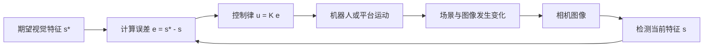

# Day 6：视觉伺服入门——相机坐标与图像误差

本文件遵循工作区根目录的 [每日学习文件编写规范](../../../每日学习文件编写规范.md)。

## 1. 今日定位

Day 1～5 解决的是：

```text
机器人如何融合运动信息与视觉观测，估计自身状态？
```

Day 6 开始解决新的问题：

```text
机器人如何根据当前图像与目标图像之间的误差，持续调整动作并完成自动对准？
```

今天只建立视觉伺服的最小概念闭环：

```text
camera image
-> 提取视觉特征位置
-> 计算 image-space error
-> 根据误差决定运动方向
-> 下一帧重新测量
```

## 2. 今日目标

完成后应能：

1. 区分像素坐标、图像中心、目标中心和当前 marker 中心。
2. 写出二维图像特征与图像误差向量。
3. 解释误差正负号为什么取决于统一的定义。
4. 解释视觉伺服为什么是闭环控制，而不是一次性计算动作。
5. 手工完成一轮“测量—计算误差—生成控制—重新测量”。
6. 为 Day 7 的 ArUco marker 检测建立清楚的输入和输出接口。

今日交付物：

```text
notes/day06_camera_and_image_error.md
```

今天以概念、公式和手算为主，不强制创建 Notebook 或 Python 脚本。

## 3. 今天明确不做

- 不检测 ArUco marker；留到 Day 7。
- 不做完整相机标定。
- 不估计三维位姿或调用 `solvePnP`。
- 不推导完整 6D interaction matrix / image Jacobian。
- 不比较 IBVS 与 PBVS 的完整算法。
- 不连接 ROS、机械臂或真实运动平台。
- 不学习 PID；今天只理解最基本的比例控制方向。
- 不写移动机器人定位项目的最终总结；该工作留到下一学习日。

## 4. 前置条件与环境

今天不依赖 EKF 代码，但应保留 Day 1～5 建立的两个习惯：

```text
1. 明确变量代表的物理量、坐标系和单位。
2. 每次更新后重新测量，不把预测值当成真实反馈。
```

后续 Day 7 使用 OpenCV 时再检查：

```python
import cv2
print(cv2.__version__)
```

今天只需要纸笔或 Markdown，NumPy 可作为可选检查工具。

## 5. 从状态估计过渡到视觉伺服

状态估计与视觉伺服都使用 camera，但任务不同：

| 问题 | 输入 | 核心输出 | 输出用途 |
|---|---|---|---|
| 状态估计 | odometry、camera measurement | 机器人状态估计 | 判断机器人在哪里 |
| 视觉伺服 | 当前视觉特征、期望视觉特征 | 控制命令 | 让机器人移动到目标状态 |

二者的共同点：

- 都必须明确坐标系和时间索引。
- 都需要处理噪声、延迟和测量缺失。
- 都依赖闭环中的最新观测。

二者的关键区别：

```text
状态估计主要输出 state estimate；
视觉伺服主要输出 control command。
```

## 6. 图像坐标系

OpenCV 常用像素坐标约定：

```text
图像左上角为原点 (0, 0)
u 轴向右为正
v 轴向下为正
```

对于宽度为 `W`、高度为 `H` 的图像，可使用：

```python
image_center = np.array([
    (W - 1) / 2.0,
    (H - 1) / 2.0,
])
```

使用 `(W - 1) / 2` 的原因：像素索引范围是 `0 ... W-1`。工程中也常近似写成 `[W/2, H/2]`；两者只相差半个像素，但同一实验中必须保持一致。

### 6.1 示例

当：

```text
W = 640 pixels
H = 480 pixels
```

采用精确像素索引中心：

```text
image_center = [319.5, 239.5] pixels
```

今天统一使用浮点坐标，不提前取整。

## 7. 视觉特征与期望特征

视觉伺服不一定直接使用整张图像，而是使用从图像中提取的特征。

本项目的最小视觉特征是 marker 中心：

```text
s = [u, v]^T
```

其中：

- `u`：marker 中心的水平像素坐标。
- `v`：marker 中心的垂直像素坐标。

期望特征定义为：

```text
s* = [u*, v*]^T
```

在最简单的“marker 对准图像中心”任务中：

```text
s* = image_center
```

后续 Day 7 从 ArUco 四个角点计算中心：

```text
marker_center = mean(corner_0, corner_1, corner_2, corner_3)
```

## 8. Image-space error

今天统一定义：

```text
e = s* - s
```

即：

```text
error = desired_feature - current_feature
```

二维形式：

```text
e = [e_u, e_v]^T
e_u = u* - u
e_v = v* - v
```

单位为：

```text
pixel
```

误差大小可用欧氏范数表示：

```text
||e||_2 = sqrt(e_u^2 + e_v^2)
```

### 8.1 误差符号解释

在 `u` 向右、`v` 向下为正的约定下：

- `e_u > 0`：目标特征位于当前特征右侧。
- `e_u < 0`：目标特征位于当前特征左侧。
- `e_v > 0`：目标特征位于当前特征下方。
- `e_v < 0`：目标特征位于当前特征上方。

这只描述“图像中特征应向哪里移动”，不等同于“机器人或相机应向哪里移动”。

## 9. 最容易混淆的问题：图像运动与执行器运动

假设 marker 在图像左侧，希望 marker 图像向右移动。相机平台究竟应该向左还是向右运动，取决于：

- 相机是固定还是随执行器运动。
- 被观察目标是固定还是运动。
- 相机图像是否镜像。
- 执行器坐标轴方向。
- 机构和相机之间的外参关系。

因此不能仅根据：

```text
u command = Kp * e_u
```

就断言真实平台的正方向。一般写成：

```text
control = K * error
```

其中 `K` 不只是增益大小，还隐含图像坐标到执行器坐标的方向映射。真实系统必须通过标定、微小试探运动或图像 Jacobian 确定该映射。

## 10. 最小比例控制模型

为了先理解闭环，Day 6 使用一个人为规定的二维图像特征模型：

```text
s_(k+1) = s_k + u_k
```

定义误差：

```text
e_k = s* - s_k
```

选择比例控制：

```text
u_k = Kp * e_k
```

则：

```text
e_(k+1) = (1 - Kp) * e_k
```

这个简化模型中：

| `Kp` 范围 | 理想行为 |
|---|---|
| `Kp = 0` | 完全不运动 |
| `0 < Kp < 1` | 单调收敛 |
| `Kp = 1` | 理想情况下单步到达目标 |
| `1 < Kp < 2` | 交替越过目标，但误差仍收敛 |
| `Kp = 2` | 等幅振荡 |
| `Kp > 2` | 误差发散 |

该结论只适用于上面的理想离散模型。真实系统还受到延迟、饱和、噪声和错误方向映射影响，不能直接把 `Kp = 1` 当作通用最优值。

## 11. 手算练习

给定：

```text
image size = 640 × 480 pixels
s* = [319.5, 239.5] pixels
s_0 = [220.0, 310.0] pixels
Kp = 0.25
```

### 11.1 第 0 步误差

请计算：

```text
e_0 = s* - s_0
||e_0||_2
```

参考结果：

```text
e_0 = [99.5, -70.5] pixels
||e_0||_2 ≈ 121.95 pixels
```

### 11.2 第 0 步控制

在简化图像模型下：

```text
u_0 = Kp * e_0
    = [24.875, -17.625] pixels/step
```

### 11.3 下一步视觉特征

```text
s_1 = s_0 + u_0
    = [244.875, 292.375] pixels
```

重新计算：

```text
e_1 = s* - s_1
    = [74.625, -52.875] pixels
```

检查：

```text
e_1 = (1 - Kp) * e_0 = 0.75 * e_0
```

这一步体现了闭环控制的核心：执行一次动作后，不假设已经对准，而是重新获取图像并计算新的误差。

## 12. 可选 NumPy 自检

如果希望用代码核对手算，可在临时 Python 终端运行：

```python
import numpy as np

image_size = np.array([640, 480])
desired_feature = (image_size - 1) / 2.0
current_feature = np.array([220.0, 310.0])
kp = 0.25

error_0 = desired_feature - current_feature
control_0 = kp * error_0
next_feature = current_feature + control_0
error_1 = desired_feature - next_feature

print("desired_feature:", desired_feature)
print("error_0:", error_0)
print("error_norm_0:", np.linalg.norm(error_0))
print("control_0:", control_0)
print("next_feature:", next_feature)
print("error_1:", error_1)
```

今天不要把这段自检扩展成完整仿真；完整误差收敛曲线留到 Day 8。

## 13. 视觉伺服闭环



如果只检测一次并发送一次动作：

```text
measurement -> command -> stop
```

这不是完整的视觉闭环，因为系统没有检查动作后的真实结果。

## 14. 噪声、丢帧和停止条件

### 14.1 噪声

Marker 中心检测会有亚像素或像素级波动。即使已经对准，误差也不一定严格等于零。

### 14.2 丢帧或检测失败

如果当前帧没有可靠 marker：

```text
不要把 marker center 设为 [0, 0]
不要继续使用一个未经限制的旧控制命令
```

最简单的安全策略：

```text
停止本轮更新，输出零控制或进入受限等待状态。
```

### 14.3 Deadband

可定义像素容差：

```text
如果 ||e||_2 < tolerance_pixels，则认为对准完成。
```

例如：

```text
tolerance_pixels = 3.0
```

Deadband 可以避免系统因检测噪声在目标附近不断抖动。

### 14.4 饱和限制

真实执行器不能无限快：

```text
u = clip(Kp * e, -u_max, u_max)
```

饱和限制能够避免初始误差较大时产生过大的动作命令。

## 15. 变量接口约定

Day 7～9 统一沿用：

| 变量 | 形状 | 单位 | 含义 |
|---|---:|---|---|
| `image_size` | `(2,)` | pixel | `[width, height]` |
| `marker_corners` | `(4, 2)` | pixel | 四个角点 `[u, v]` |
| `current_feature` | `(2,)` | pixel | 当前 marker 中心 `s` |
| `desired_feature` | `(2,)` | pixel | 期望中心 `s*` |
| `image_error` | `(2,)` | pixel | `s* - s` |
| `error_norm` | scalar | pixel | `||image_error||_2` |
| `control_command` | `(2,)` | 暂定 | 映射后的二维控制命令 |

注意：只有 image error 的单位明确是 pixel。真实平台控制命令可能是 `mm/s`、`rad/s` 或电机脉冲，必须经过映射后才能赋予物理单位。

## 16. 推荐学习顺序

### Step 1：画出图像坐标系

在纸上标出：

```text
原点、u 正方向、v 正方向、图像中心、当前 marker 中心
```

### Step 2：计算二维误差

使用第 11 节数据，独立算出 `e_0` 和误差范数。

### Step 3：判断特征应向哪里移动

根据 `e_u`、`e_v` 的符号，用语言描述 marker 图像需要向哪个方向移动。

### Step 4：完成一次比例更新

计算 `u_0`、`s_1`、`e_1`，确认误差缩小为原来的 75%。

### Step 5：解释闭环

不看笔记，独立说出：

```text
检测 -> 误差 -> 控制 -> 运动 -> 重新检测
```

### Step 6：准备 Day 7 接口

明确 Day 7 的 ArUco 检测只需要先输出：

```text
marker_corners: (4, 2)
marker_center: (2,)
```

## 17. 常见错误

### 17.1 把 `width` 和 `height` 写反

统一：

```text
image_size = [width, height]
feature = [u, v]
```

### 17.2 忘记 v 轴向下

图像坐标通常不是数学课中的 y 轴向上。

### 17.3 前后混用两种误差定义

下面两种定义都可以：

```text
e = desired - current
e = current - desired
```

但控制律符号必须与定义匹配。本项目统一使用第一种。

### 17.4 把像素控制量直接当作毫米

Pixel 与物理位移之间需要标定或 Jacobian，不能直接等同。

### 17.5 只执行一次动作

视觉伺服的价值来自持续反馈，而不是一次性从误差猜测最终动作。

### 17.6 检测失败时填入 `[0, 0]`

这会把“无测量”误认为 marker 位于图像左上角。

## 18. 今日验收标准

文件验收：

- `notes/day06_camera_and_image_error.md` 存在。

计算验收：

- 能算出 `image_center = [319.5, 239.5]`。
- 能算出 `e_0 = [99.5, -70.5] pixels`。
- 能算出 `u_0 = [24.875, -17.625] pixels/step`。
- 能验证 `e_1 = 0.75 e_0`。

理解验收：

- 能解释 `s`、`s*` 和 `e`。
- 能解释像素坐标中 `v` 轴为什么向下。
- 能解释图像特征运动方向不等于真实执行器运动方向。
- 能解释视觉伺服为什么必须反复获取新图像。
- 能说明检测失败时为什么不能传入 `[0, 0]`。

## 19. 必答问题

1. 什么是 image-space error？它的单位是什么？
2. 为什么 marker center 可以作为最小视觉反馈特征？
3. 为什么 `error = desired - current` 与 `error = current - desired` 都可能正确？
4. 为什么仅知道像素误差，还不能直接确定平台应向哪个物理方向运动？
5. 开环视觉定位与视觉伺服闭环的主要区别是什么？
6. Marker 暂时检测失败时，控制器应该如何处理？
7. Deadband 和控制饱和分别解决什么问题？

## 20. 今日结果记录（学习后填写）

```text
完成日期：
实际投入时间：
是否完成手算：
是否能独立画出图像坐标系：
是否能独立解释闭环：
仍不理解的内容：
```

用 3～5 句话总结：

```text
今天理解了哪些输入、误差定义、控制关系和系统限制？
```

## 21. 下一步：Day 7

下一学习日进入：

```text
ArUco marker generation / image loading
-> detectMarkers
-> corners
-> marker center
-> image error visualization
```

预计交付物：

```text
scripts/01_detect_aruco_marker.py
figures/aruco_detection.png
```

Day 7 仍不控制真实机械臂，只把今天定义的 `current_feature` 从“手工给定”替换为“由图像检测得到”。
